# Incubyte_Assessment_test
# Sweet Shop Management System

This project helps to manage sweets in a shop. Right now, it has the "Add Sweet" feature using TDD.

## ✅ Features Implemented

- Add sweet

- Delete sweet 

- View Sweets

- Search By Name

- Search By Category

- Search By PriceRange

- Purchase sweets (inventory updates)

-> 🔁 Restock Sweet

- Add more quantity to a sweet using its ID.
- If sweet not found, it throws an error.

## Screenshots
1.ADD SWEETS

### 🔴 Failing Test

### 🟢 Passing Test

2.DELETE SWEETS

🔴 Delete Sweet - Failing Test  
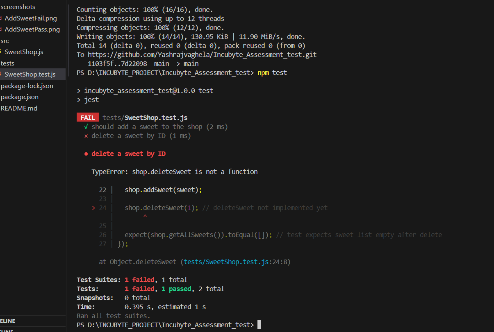

🟢 Delete Sweet - Passing Test  
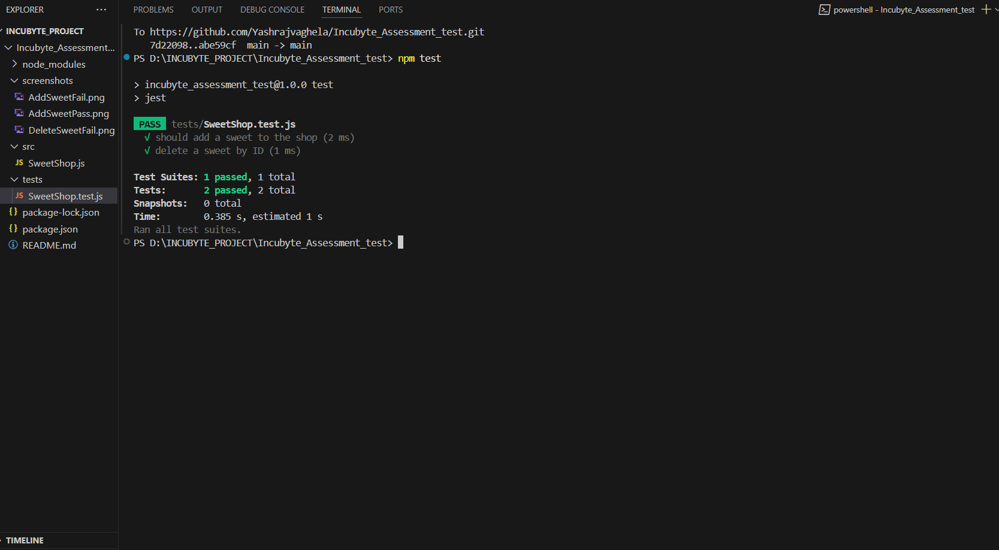

3.VIEW ALL SWEETS

 🔴Failing Test

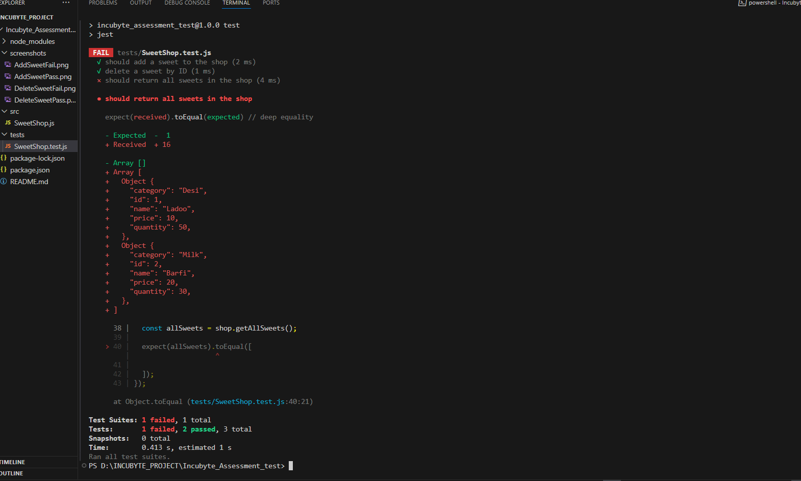

 🟢 Passing Test

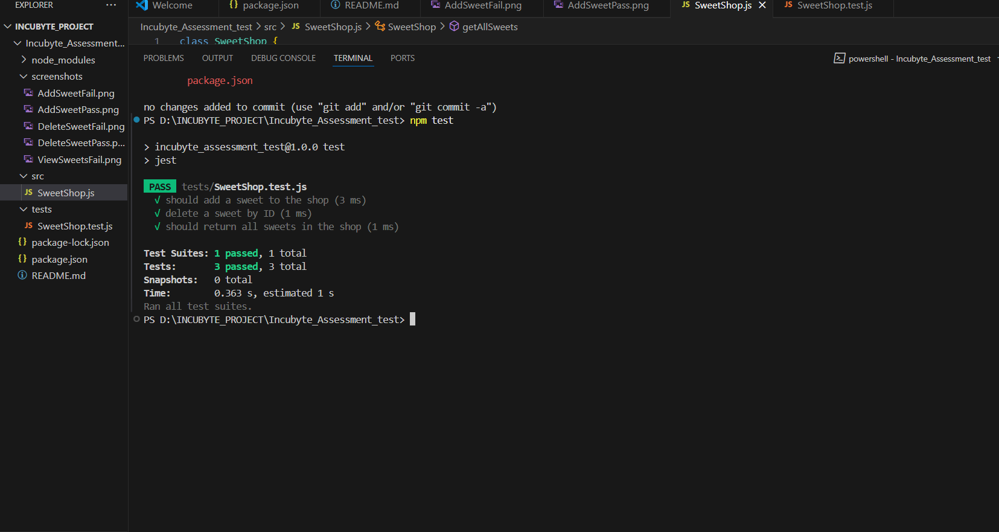

4.SEARCH BY NAME

🔴Failing Test

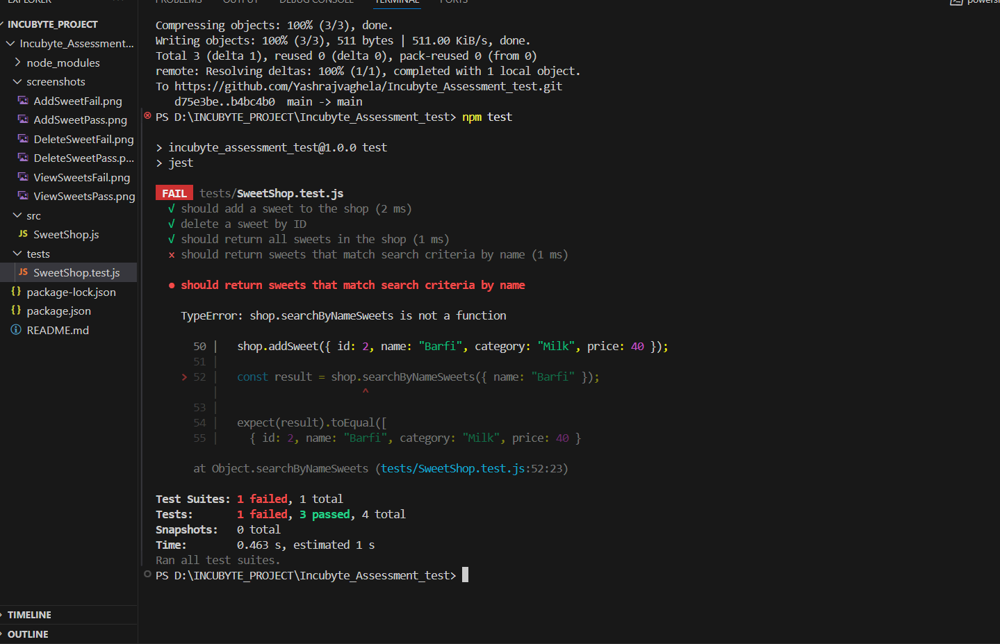

 🟢 Passing Test

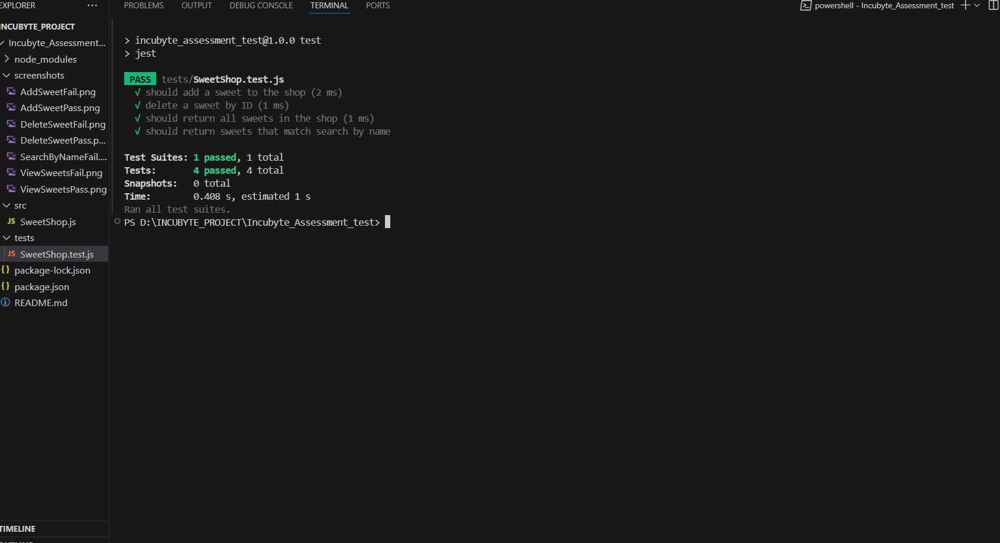

5.SEARCH BY Category

🔴Failing Test

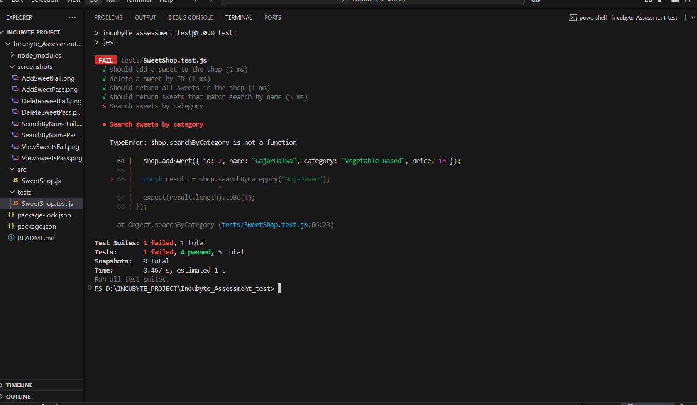

 🟢 Passing Test

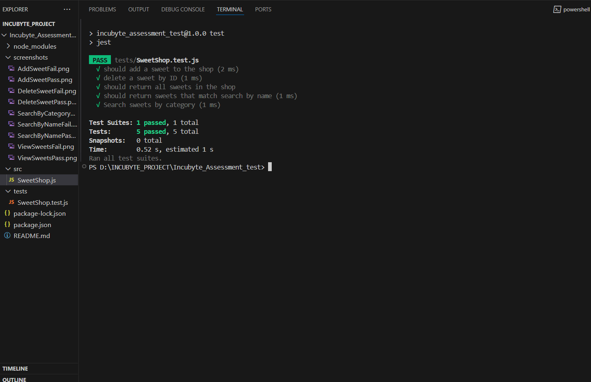

5.SEARCH BY PriceRange

🔴Failing Test

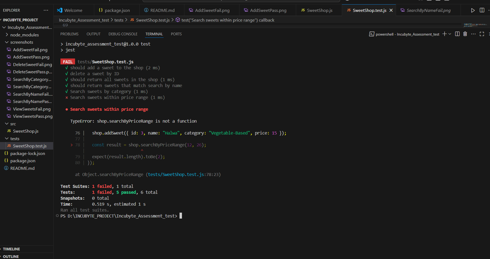

 🟢 Passing Test

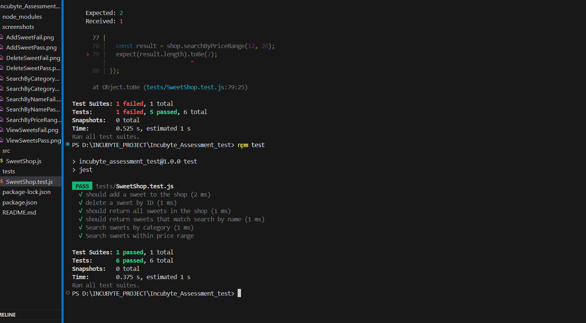

6.🛒 PURCHASE SWEET

🔴Failing Test

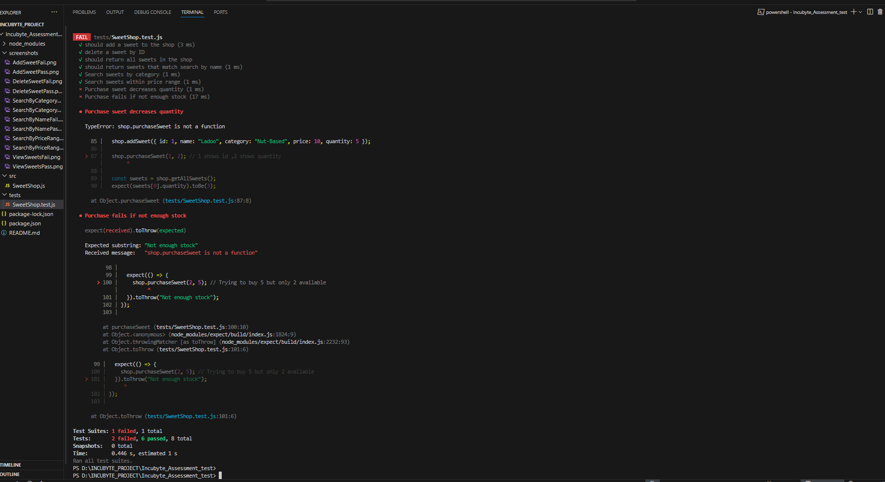

 🟢 Passing Test

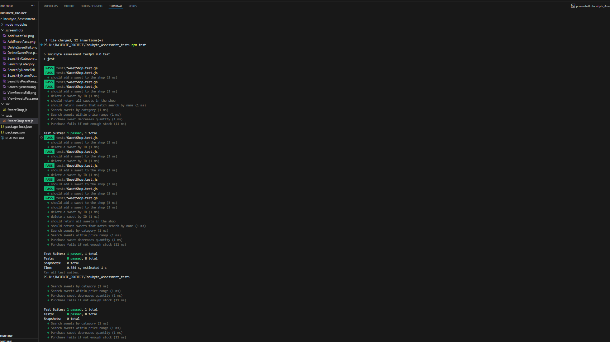

6.🛒 PURCHASE SWEET

🔴Failing Test

 🟢 Passing Test

7.RESTOCK SWEET

🔴Failing Test

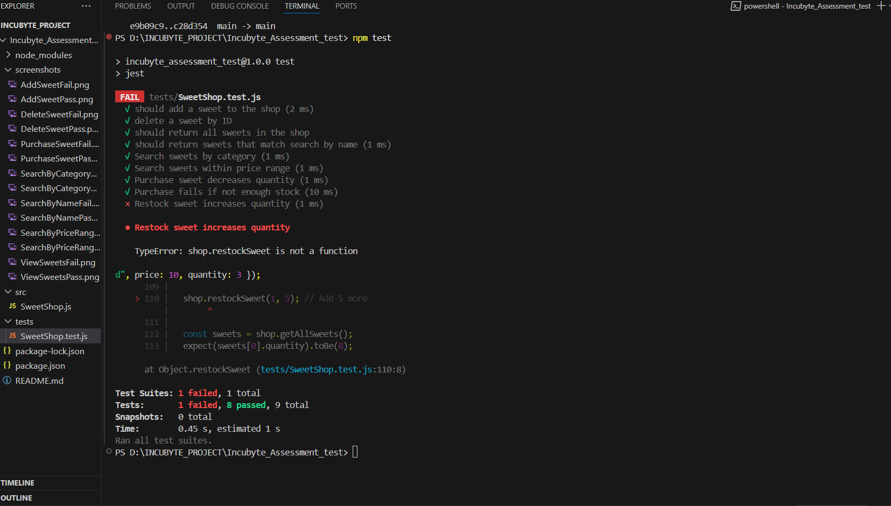

 🟢 Passing Test

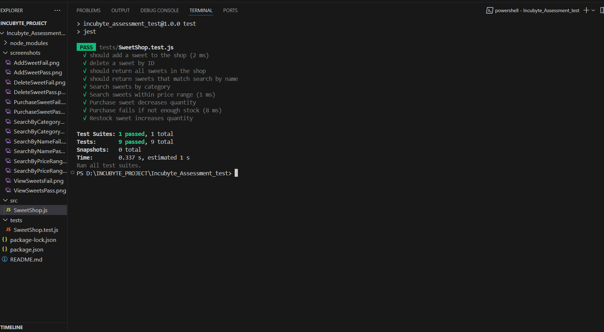

