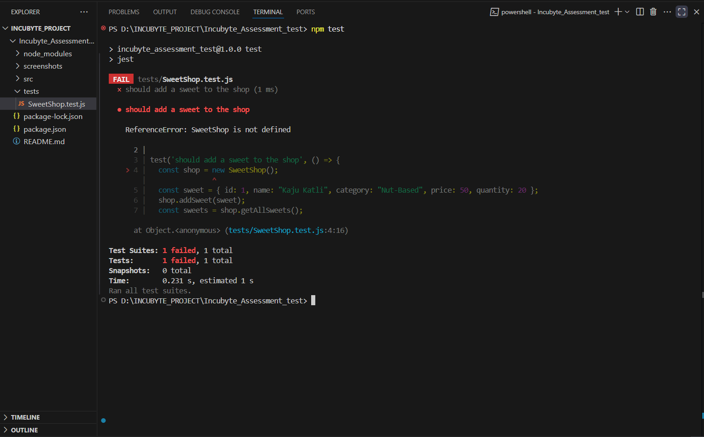
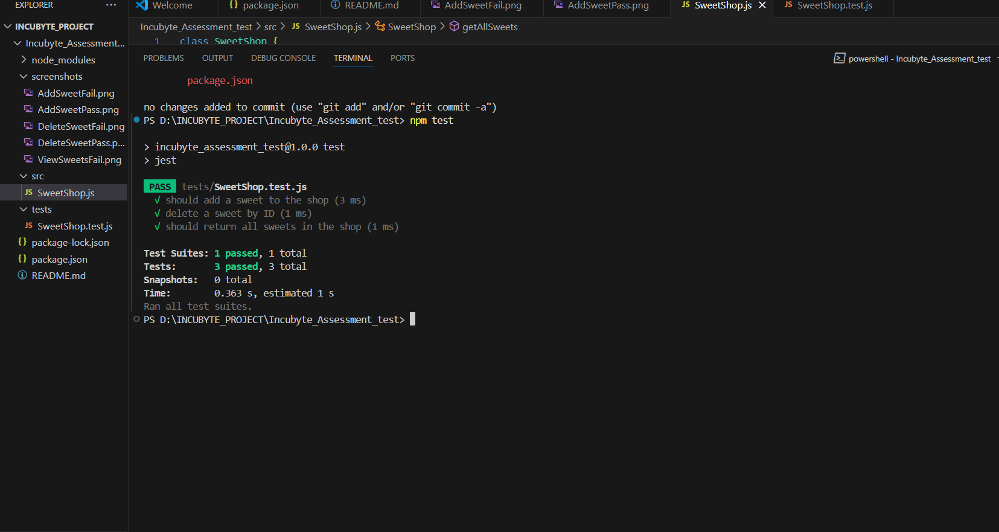
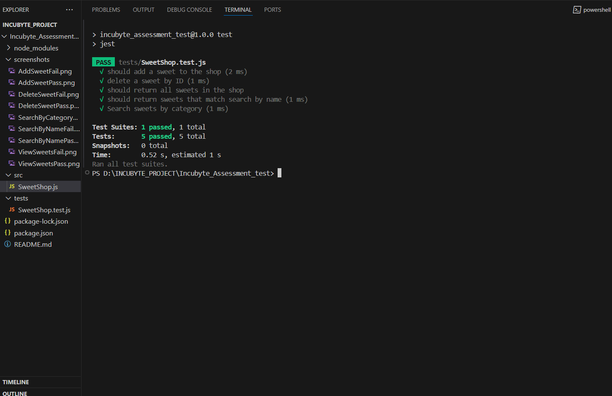
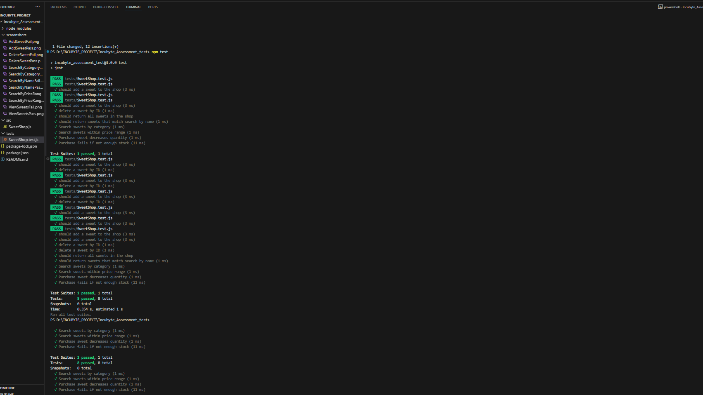
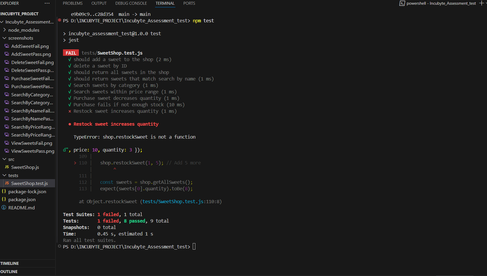

# Incubyte_Assessment_test
# Sweet Shop Management System

This is a simple project made using Test-Driven Development (TDD). It helps to manage a sweet shop. You can add sweets, delete them, view all sweets, and search them by name, category, or price. You can also restock sweets and manage quantity.

## ✅ Features Implemented

- Add sweet

- Delete sweet 

- View Sweets

- Search By Name

- Search By Category

- Search By PriceRange

- Purchase sweets (inventory updates)

-> 🔠Restock Sweet

- Add more quantity to a sweet using its ID.
- If sweet not found, it throws an error.

🧱 Project Structure

<pre> SweetShopProject/ ├── src/ │ └── sweetshop.js # Logic for sweet shop ├── tests/ │ └── sweetshop.test.js # All test cases (TDD) ├── screenshots/ # Pass/fail test result images │ ├── AddFail.png │ ├── AddPass.png │ └── ... ├── package.json # Project metadata ├── package-lock.json └── README.md # Project description and guide </pre>
## Screenshots
1.ADD SWEETS

### 🔴 Failing Test

### 🟢 Passing Test

2.DELETE SWEETS

🔴 Delete Sweet - Failing Test  

🟢 Delete Sweet - Passing Test  

3.VIEW ALL SWEETS

 🔴Failing Test

 🟢 Passing Test

4.SEARCH BY NAME

🔴Failing Test

 🟢 Passing Test

5.SEARCH BY Category

🔴Failing Test

 🟢 Passing Test

5.SEARCH BY PriceRange

🔴Failing Test

 🟢 Passing Test

6.🛒 PURCHASE SWEET

🔴Failing Test

 🟢 Passing Test

6.🛒 PURCHASE SWEET

🔴Failing Test

 🟢 Passing Test

7.RESTOCK SWEET

🔴Failing Test

 🟢 Passing Test

